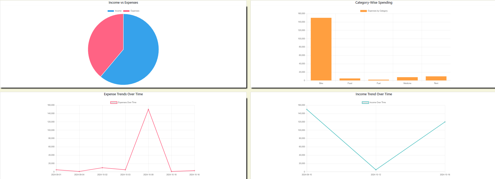
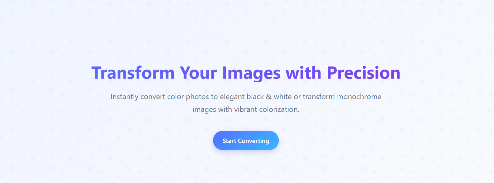

# 👋 Hi there, I'm Hadi KP!

<div align="center">
  
</div>

<p align="center">
  
  
  <a href="https://haadikp.github.io/Portfolio/">
    
  </a>
</p>

<div align="center">
  <h3>
    📊 Data Scientist | 🎓 MCA Graduate | 🧮 BSc Mathematics | 🏆 UGC NET Qualified for CS
  </h3>
  <h4>
    Intern at Sabudh Foundation
  </h4>

  <p>
    <strong>📍 Kerala, India</strong>
  </p>
</div>

---

## 🚀 About Me

```python
class HadiKP:
    def __init__(self):
        self.name = "Hadi KP"
        self.role = "Aspiring Data Scientist"
        self.education = {
            "current": "MCA Graduate (2025) - CGPA: 7.95/10",
            "previous": "BSc Mathematics (2023) - CGPA: 7.1/10"
        }
        self.achievements = ["UGC NET Qualified for Assistant Professor"]
        self.location = "Kerala, India"
        self.interests = [
            "Data Science & Machine Learning",
            "Software Development",
            "Data Analytics",
            "Python Programming"
        ]
        self.motto = "Leveraging programming skills to develop data-driven solutions"
    
    def get_portfolio(self):
        return "https://haadikp.github.io/Portfolio/"
    
    def say_hi(self):
        return "Thanks for visiting my profile! Let's connect and build something amazing together!"

# Initialize
hadi = HadiKP()
print(hadi.say_hi())
```

---

##  What I Do
<div align="center">
  <table>
    <tr>
      <td align="center" width="20%">
        
        <br><br>
        <h4>🔬 Data Science & Analytics</h4>
        <p>Passionate about extracting insights from data</p>
      </td>
<!--       <td align="center" width="20%">
        
        <br><br>
        <h4>💻 Software Engineer</h4>
        <p>Building scalable and efficient softwares</p>
      </td> -->
      <td align="center" width="20%">
        
        <br><br>
        <h4>🤖 Machine Learning</h4>
        <p>Developing intelligent systems and models</p>
      </td>
      <td align="center" width="20%">
        
        <br><br>
        <h4>🧠 Research</h4>
        <p>UGC NET qualified, interested in academic research</p>
      </td>
      <td align="center" width="20%">
        
        <br><br>
        <h4>📚 Continuous Learning</h4>
        <p>Always exploring new technologies and methodologies</p>
      </td>
    </tr>
  </table>
</div>
<div align="center">
  
</div>

 ##  Featured Projects
<div align="center">
  <table>
    <tr>
      <td width="50%" align="center">
        
        <br><br>
        <h3>🏦 Personal Finance Management System</h3>
        <h4><strong>Tech Stack:</strong> Python Flask | HTML/CSS | MySQL</h4>
        <div align="left">
          <br>
          ✅ Developed a comprehensive web-based application for financial tracking<br>
          ✅ Implemented secure user authentication and data management<br>
          ✅ Created intuitive dashboard for expense tracking and budget management<br>
        </div>
      </td>
      <td width="50%" align="center">
        
        <br><br>
        <h3>🎨 Image Colorization using GANs</h3>
        <h4><strong>Tech Stack:</strong> Python | PyTorch | Flask | NumPy | PIL | scikit-image</h4>
        <div align="left">
          <br>
          ✅ Built an AI-powered system to convert grayscale images to color<br>
          ✅ Implemented Generative Adversarial Networks (GANs) for realistic colorization<br>
          ✅ Developed web interface for easy image upload and processing<br>
        </div>
      </td>
    </tr>
  </table>
</div>
<div align="center">
  
</div>

##  Technical Skills
<div align="center">
  
</div>
<br>
<div align="center">
  <h3>🚀 Programming Languages</h3>
  
  <br><br>
  
  
  
  
</div>
<br>
<div align="center">
  <h3>🔧 Frameworks & Libraries</h3>
  
  <br><br>
  
  
  
  
  
</div>
<br>
<div align="center">
  <h3>🗄️ Database & Tools</h3>
  
  <br><br>
  
  
  
  
</div>
<div align="center">
  
</div>


##  Education & Certifications
<div align="center">
  <table>
    <tr>
      <td align="center" width="50%">
        
        <br>
        <h2>📚 Education</h2>
        <div align="left" style="padding: 20px;">
          <h3>🎓 Master of Computer Applications (MCA) - <em>2025</em></h3>
          <p>📍 Rajiv Gandhi Institute of Technology, Kottayam<br>
          🏆 <strong>CGPA: 7.95/10</strong></p>
      <h3>🧮 Bachelor of Science in Mathematics - <em>2023</em></h3>
      <p>📍 Sullamussalam Arts and Science College, Areekode<br>
      🏆 <strong>CGPA: 7.1/10</strong></p>
    </div>
  </td>
      
  <td align="center" width="50%">
    
    <br>
    <h2>🏆 Certifications</h2>
    <div align="left" style="padding: 20px;">
      <h4>🐍 <strong>Python for Data Science, AI & Development</strong></h4>
      <p>IBM (Coursera) - <em>June 2024</em></p>
      <h4>🗃️ <strong>Database Management System</strong></h4>
      <p>IIT Kharagpur (NPTEL) - <em>April 2024</em></p>
      <h4>📊 <strong>Using Basic Formulas and Functions in Microsoft Excel</strong></h4>
      <p>Coursera - <em>December 2024</em></p>
    </div>
  </td>
</tr>
  </table>
</div>
<div align="center">
  
  
  
</div>
<div align="center">
  
</div>

## 📊 GitHub Analytics

<div align="center">
  
</div>

<div align="center">
  
</div>

---

## 🏆 GitHub Trophies

<div align="center">
  
</div>

---

## 📈 Contribution Activity

<div align="center">
  
</div>

---

## 🌟 Core Competencies

<div align="center">
  
| **Technical Skills** | **Soft Skills** |
|:---:|:---:|
| 🐍 Python Programming | 🧠 Problem-Solving |
| 🤖 Machine Learning | 🤝 Teamwork |
| 📊 Data Analytics | ⏰ Time Management |
| 🌐 Web Development | 🔄 Adaptability |
| 🗃️ Database Management | 💭 Critical Thinking |
| 📈 Statistical Analysis | 💬 Communication |

</div>

---

## 🎯 Current Focus

- 🔬 **Deep Learning**: Advancing skills in neural networks and deep learning frameworks
- ☁️ **Cloud Computing**: Exploring AWS and cloud-based data solutions
- 📊 **Big Data**: Learning tools for handling large-scale data processing
- 🚀 **MLOps**: Understanding deployment and monitoring of ML models
- 🎓 **Research**: Preparing for academic opportunities with UGC NET qualification

---

## 📫 Let's Connect!

<div align="center">
  <a href="https://haadikp.github.io/Portfolio/">
    
  </a>
  <a href="https://www.kaggle.com/hadikp">
    
  </a>
  <a href="https://linkedin.com/in/hadi-kp">
    
  </a>
  <a href="mailto:hadikpkuniyil@gmail.com">
    
  </a>
</div>

---

## 💡 Random Dev Quote

<div align="center">
  
</div>

---

## 🎨 Some Facts

- 🧮 **Mathematics Background**: My BSc in Mathematics gives me a strong foundation for data science
- 🏆 **UGC NET Qualified**: Ready to contribute to academic research and teaching
- 🐍 **Python Enthusiast**: My go-to language for solving complex problems
- 📊 **Data Storyteller**: I believe data has stories to tell, and I love uncovering them
- 🚀 **Continuous Learner**: Always exploring new technologies and methodologies

---

<div align="center">
  <h3>💫 "Data is not information, information is not knowledge, knowledge is not understanding, understanding is not wisdom." - Clifford Stoll</h3>
  
  <p>
     
    <em><b>I'm passionate about turning data into insights</b> and would love to collaborate on interesting projects! <b>Let's build something amazing together!</b> 🚀</em>
  </p>
</div>

---

<div align="center">
  <sub>⭐️ From <a href="https://github.com/Haadikp">Hadi KP</a> | 🎯 Aspiring Data Scientist | 🏆 UGC NET Qualified for CS</sub>
</div>

<div align="center">
</div>
