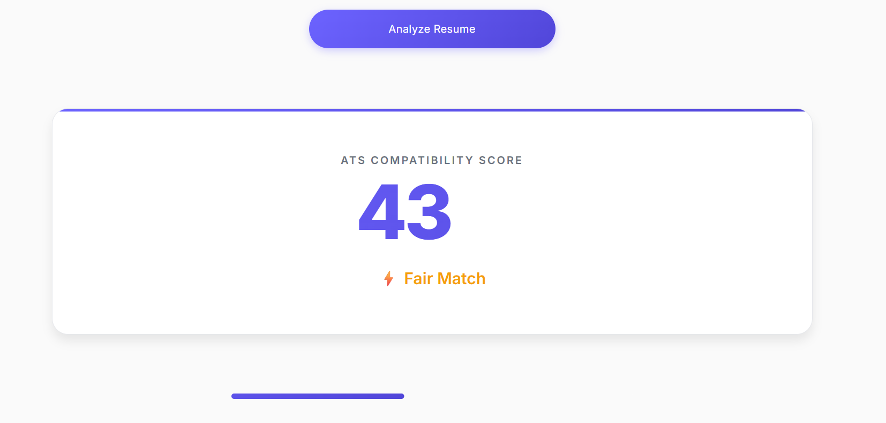
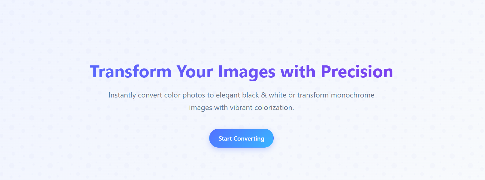

<div align="center">

<!-- ═══════════════════════════════════════════════════════════════════
     BANNER  —  Replace the src below with your actual banner image URL
     Recommended: 1280×640 px, dark theme, name + title + subtle code art
     ═══════════════════════════════════════════════════════════════════ -->


<br/>

<a href="https://haadikp.github.io/Portfolio/"></a>
&nbsp;
<a href="https://linkedin.com/in/hadi-kp"></a>
&nbsp;
<a href="https://www.kaggle.com/hadikp"></a>
&nbsp;
<a href="mailto:hadikpkuniyil@gmail.com"></a>
&nbsp;


</div>

---

## 🎬 Visual Demo

<div align="center">

<!-- ══════════════════════════════════════════════════════════════
     DEMO GIF  —  Record a Loom / ScreenToGif walkthrough of your
     portfolio, export as GIF, upload to the repo, and replace src.
     Recommended resolution: 1280×720 px
     ══════════════════════════════════════════════════════════════ -->


<br/><sub><i>↑ <a href="https://haadikp.github.io/Portfolio/">Live site</a> · Hover over any card to experience the anti-gravity effect ✨</i></sub>

</div>

---

## 🚀 About Me

```python
class HadiKP:
    name       = "Hadi K P"
    role       = "Data Scientist & Software Engineer"
    location   = "Kerala, India 📍"
    education  = {
        "MCA  (2025)": "Rajiv Gandhi Institute of Technology — CGPA 7.95/10",
        "BSc Mathematics (2023)": "Sullamussalam Arts & Science College — CGPA 7.1/10",
    }
    achievements = ["🏆 UGC NET Qualified — Assistant Professor (CS)", "🥇 Kaggle Expert (Notebooks)"]
    stack        = ["Python", "Flask", "PyTorch", "LangChain", "MySQL", "Scikit-learn", "TensorFlow"]
    interests    = ["Generative AI", "MLOps", "Data Analytics", "Backend Engineering"]
    motto        = "Turning raw data into real decisions — one model at a time."

    def say_hi(self):
        return "I'm open to opportunities — let's build something remarkable! 🚀"
```

---

## 🛠️ Built With

### Languages
<div align="center">


</div>

### AI / ML Stack
<div align="center">


</div>

### Web & Backend
<div align="center">


</div>

### Tools & Platforms
<div align="center">


</div>

---

## ✨ Portfolio Features

| Feature | Description |
|:---|:---|
| 🌌 **Anti-Gravity Cards** | Project cards & tech icons levitate using CSS `@keyframes`. Move your cursor near them — they repel and tilt in 3D via a `requestAnimationFrame` mouse-tracking loop |
| 🎨 **Glassmorphism UI** | Every card uses `backdrop-filter: blur(12px)` + translucent borders on a deep `#060813` dark background |
| 🔠 **Premium Typography** | `Syne` for display headings · `Inter` for body text · `JetBrains Mono` for code labels |
| 📊 **Animated Skill Bars** | Progress bars animate into view on scroll via `IntersectionObserver` |
| 🔭 **Scroll Spy Nav** | Active nav-link highlights automatically as you scroll between sections |
| 📱 **Fully Responsive** | Single-column layout on mobile with a full-screen glass drawer for navigation |
| ⚡ **Zero Build Step** | Pure HTML + Vanilla CSS + Vanilla JS — no bundler, no framework. Deploy anywhere instantly |
| 🚀 **GitHub Pages Ready** | One push to `main` and it's live — no CI/CD configuration needed |

---

## 🏗️ Featured Projects

<details>
<summary><strong>🤖 AI Job Analyzer</strong> — LangChain · Groq (LLaMA 3.3-70B) · Gradio</summary>

<br/>

<div align="center">

</div>

**What it does:**
- Scrapes & extracts job requirements directly from posting URLs
- Parses uploaded PDF resumes for skills, education and work history
- Performs deep skill-gap analysis with match scores (High / Medium / Low)
- Auto-generates customized technical and HR interview questions
- Clean, interactive Gradio UI for structured visualization

[](https://github.com/Haadikp/Job-Aanalyzer-AI)

</details>

<details>
<summary><strong>🎨 Image Colorization using GANs</strong> — PyTorch · Flask · scikit-image</summary>

<br/>

<div align="center">

</div>

**What it does:**
- Converts grayscale images to realistic colour using Generative Adversarial Networks
- Custom GAN architecture trained end-to-end with PyTorch
- Web interface built with Flask for drag-and-drop image upload & processing
- Post-processing pipeline with PIL and scikit-image for enhanced output quality

[](https://github.com/Haadikp/Image_Colourization)

</details>

<details>
<summary><strong>💰 Personal Finance Management System</strong> — Flask · MySQL · HTML/CSS</summary>

**What it does:**
- Full-stack web app for tracking income, expenses and savings goals
- User authentication, category-based analytics and monthly reports
- Clean dashboard built with Flask + Jinja2 templating and vanilla CSS

[](https://github.com/Haadikp/FinanceManager)

</details>

---

## 🎓 Education & Certifications

<details>
<summary><strong>📚 Academic Background</strong></summary>

| Degree | Institution | Year | Grade |
|:---|:---|:---:|:---:|
| 🎓 Master of Computer Applications | Rajiv Gandhi Institute of Technology, Kottayam (KTU) | 2025 | **7.95 / 10** |
| 🧮 BSc Mathematics | Sullamussalam Arts & Science College, Areekode (Calicut University) | 2023 | **7.1 / 10** |
| 📘 Plus Two (Science) | Kerala State Board | 2020 | **88%** |
| 📗 SSLC | Kerala State Board | 2018 | **A+ (100%)** |

</details>

<details>
<summary><strong>🏆 Certifications</strong></summary>

| Certificate | Issuer | Year |
|:---|:---|:---:|
| 🏅 **UGC NET** — Qualified for Assistant Professor (CS) | NTA / UGC | 2024 |
| 🤖 Dataiku ML Practitioner | Dataiku | 2025 |
| 🎨 Dataiku Advanced Designer | Dataiku | 2025 |
| 📐 Dataiku Core Designer | Dataiku | 2025 |
| 📊 Intermediate Machine Learning | Kaggle | 2025 |
| 📈 Introduction to Machine Learning | Kaggle | 2025 |
| 🔬 Data Analytics | YBI Foundation | 2024 |
| 🐍 Python for Data Science, AI & Development | IBM / Coursera | 2024 |
| 🗃️ Database Management Systems | IIT Kharagpur (NPTEL) | 2024 |
| 📊 Introduction to Microsoft Excel | Coursera Project Network | 2024 |

</details>

---

## 📊 GitHub Analytics

<div align="center">


&nbsp;


</div>

---

## 🚀 Getting Started

Clone and open the portfolio locally:

```bash
# 1. Clone the repository
git clone https://github.com/Haadikp/Portfolio.git

# 2. Navigate into the project
cd Portfolio

# 3. Open in your browser — no build step needed!
open index.html          # macOS
start index.html         # Windows
xdg-open index.html      # Linux
```

> **Tip:** For the best experience with local images and assets, serve with [VS Code Live Server](https://marketplace.visualstudio.com/items?itemName=ritwickdey.LiveServer) or any static server.

### Deploying to GitHub Pages

```bash
git add .
git commit -m "chore: update portfolio"
git push origin main
```

Then go to **Settings → Pages** in your repo and set the source to `main / root`. Your site will be live at `https://haadikp.github.io/Portfolio/` within minutes.

---

## 🎯 Currently Exploring

- 🧠 **Generative AI** — Prompt engineering, RAG pipelines, fine-tuning LLMs  
- ☁️ **Cloud ML** — AWS SageMaker, model serving at scale  
- 📦 **MLOps** — Experiment tracking (MLflow), CI/CD for ML  
- 🔬 **Research** — Leveraging UGC NET qualification for academic contributions  

---

## 📬 Connect With Me

<div align="center">

<a href="https://haadikp.github.io/Portfolio/">
  
</a>
&nbsp;
<a href="https://linkedin.com/in/hadi-kp">
  
</a>
&nbsp;
<a href="https://www.kaggle.com/hadikp">
  
</a>
&nbsp;
<a href="https://www.instagram.com/haadi.kp">
  
</a>
&nbsp;
<a href="mailto:hadikpkuniyil@gmail.com">
  
</a>

</div>

---

<div align="center">


<br/><br/>


<sub>⭐ If you found this portfolio inspiring, consider starring the repo! &nbsp;|&nbsp; Built with 💜 by <a href="https://github.com/Haadikp">Hadi K P</a></sub>

</div>
